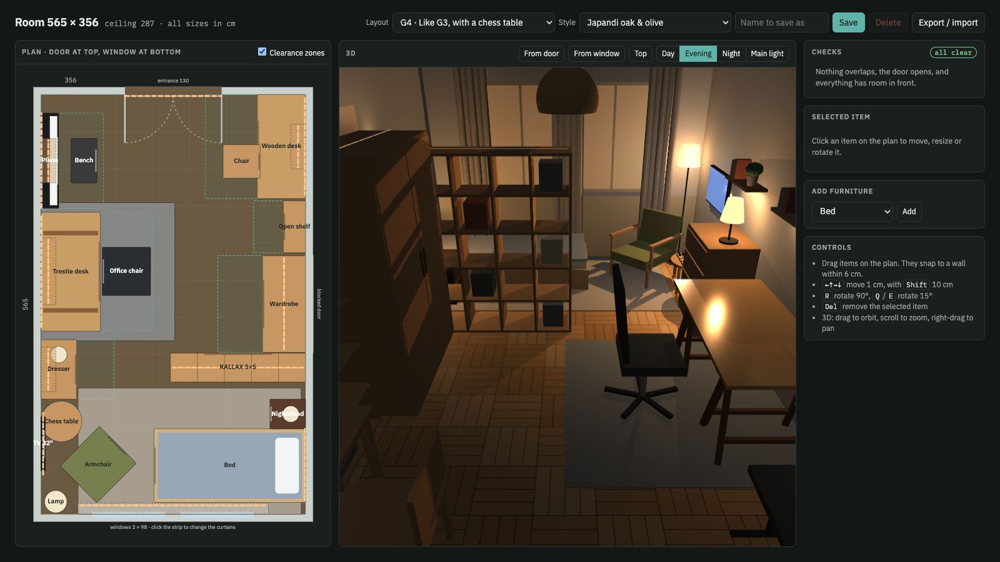

# Room Planner 565 × 356

A small single-file tool for planning one real room: a draggable top-down plan, a live 3D view, and checks that tell you when a layout doesn't work.

## Use it

Open `room.html` in a browser. There's no build step and nothing to install. The 3D view loads three.js from a CDN, so it needs an internet connection; the plan and checks work without it.

## What it does

- **Plan:** drag, rotate and resize furniture in centimetres. Pieces snap to walls, and each one shows the space it needs in front.
- **3D:** simple models of each piece, with Day, Evening, Night and Main light modes. Lamps, the ceiling pendant, the TV and LED strips give off real light.
- **Styles:** one menu recolours the whole room (wood, fabrics, rugs, bedding, curtains) across 20 colour schemes.
- **Checks:**
  - Overlaps, pieces blocking the door swing, and furniture in the way of the curtains.
  - A 60 cm walking path from the door to every piece you use.
  - Feng shui: the bed and the main desk placed so you can see who's coming.
  - Lighting: every place you use is lit without the ceiling light.
- **Layouts:** ready-made suggestions plus your own, saved in the browser. Use Export / import to move them between browsers or back them up as JSON.
- **Real products:** select a piece and switch it between its generic form and real products from IKEA, JYSK and Bazoš (second-hand, within 25 km of Prague). A product brings its real size, colours and a 3D shape made to look like its photo, and the checks run on the new size. The shopping list adds up the price of everything you've picked.

## How it's built

Everything lives in `room.html`:

- **`<script id="core">`:** the room, the furniture catalogue, the layouts and all checks. It has no DOM access, so it can run on its own in Node.
- **Main script:** the SVG plan, the side panel, and the three.js scene.

The products live in `products.js`, one list per kind of piece. Each product has its shop link, a photo, the price, W×D×H, colours and `look` hints for its 3D shape. Prices and Bazoš listings were checked on 29 September 2026, so a listing may already be sold. `node check.js` swaps every product into every built-in layout and fails if one ends up outside the room or doesn't swap back cleanly.

### Adding or refreshing products

The scripts in `tools/` use only the Python standard library and macOS `sips`:

- `ikea_search.py` searches IKEA CZ and `bazos.py` searches Bazoš near Prague, to find candidates.
- `details.py` fetches an IKEA or JYSK product page (name, price, W×D×H, photo, main colours) for each `category url` line in a text file.
- `build_products.py` merges the fetched data in `tools/data/` with its hand-checked table (size, colours, `look`) and writes `products.js`.

To add a product, fetch it into `tools/data/extra.jsonl` with a new number (`START=301 python3 tools/details.py new.txt >> tools/data/extra.jsonl`), check the photo in `tools/img/`, add a row for it to the table in `build_products.py`, then run `python3 tools/build_products.py` and `node check.js`. Bazoš listings are added by hand, since sellers write sizes in the description.

Room and furniture sizes are the real measurements of one room. For another room, change `ROOM`, `DOOR`, `EDOOR` and `WINDOWS` at the top of the core script. The built-in layouts are placed for this room and won't fit anywhere else.
